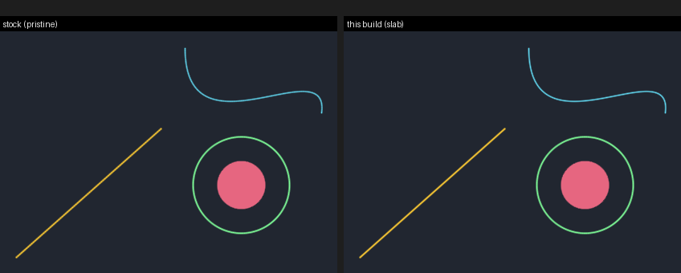
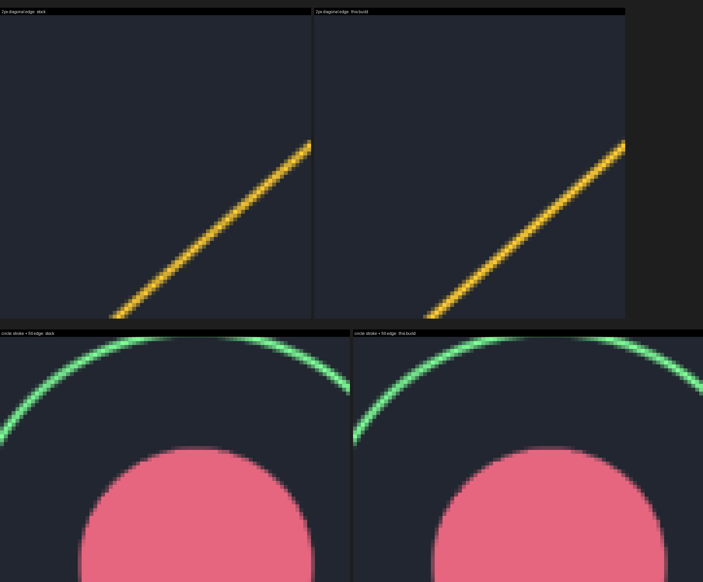
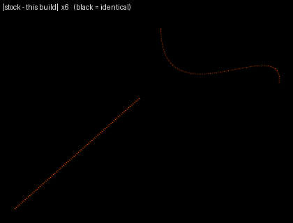
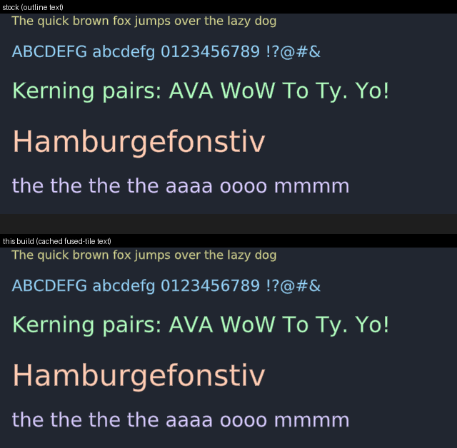
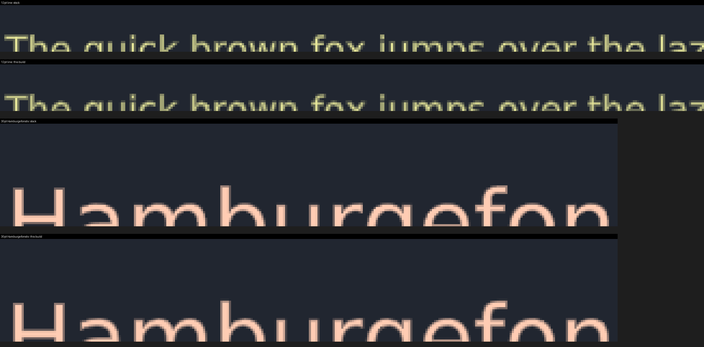
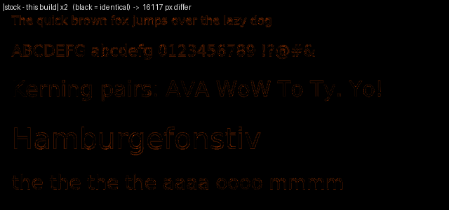

# Validation

This build is **visually equivalent** to the stock rasterizer, **not bit-identical**.
This directory documents exactly where and how much the output differs, with measured
numbers and rendered comparisons — so you can judge for yourself.

## The short version

- **Solid fill interiors** and the **plugin's outline text** are pixel-for-pixel
  identical. The bulk interior-run fast path is bit-identical by construction, and the
  text outline path is unchanged.
- **Everything with an anti-aliased edge** — strokes, curves, and the AA boundary of
  fills — differs *slightly*. The stroke/curve rasterizer computes the **exact analytic
  per-pixel distance to the geometry**; stock **hop-samples** a pen along the path. Same
  alpha function, slightly different coverage on edge pixels.
- Differences are **small and confined to edges**: worst-case Δ41/255 on a single
  channel; ~72% of all differing pixels are ≤ Δ6/255. Nothing structural moves.

The arithmetic-level optimizations layered on top of the rasterizer (opaque-target fast
path, bulk runs, gang-skip, dirty-span journal) *are* provably bit-identical — see the
main [README](../README.md#what-makes-it-faster) and `../check_alpha_identity.c`. The
non-bit-identity comes from **one** thing: exact-distance slab stamping replacing
hop-sampling.

## Rendered comparison

A scene of AA-revealing primitives (`quality.st`), rendered under each plugin. At 1×
the two are indistinguishable:



Zoomed 10× (nearest-neighbor) on a 2px diagonal and the stroked-circle/fill edges — this
build's stroke AA is marginally **more uniform** (stock's hop-sampler leaves a faint
brightness ripple along the diagonal; exact-distance stamping is even):



The absolute difference (×6, black = identical) — every non-black pixel is an
anti-aliased edge; interiors and the filled disc are pure black:



Individual renders are `quality-stock.png` and `quality-this.png` if you want to run your
own diff.

## Text

Text has **two** paths, held to different standards:

- **Plugin outline text** (just the bundle, no `VectorEngineOpt`) is **bit-identical** to
  stock — the outline rasterization path is unchanged (the "text" band in the table below
  is 0.0%).
- **Cached fused-tile text** (with `VectorEngineOpt` loaded) is **visually equivalent but
  not bit-identical**. The glyph-tile cache bakes each glyph at **8 sub-pixel phases —
  quarter-pixel horizontally, half-pixel vertically** (`GlyphTileCache`), then composites
  the nearest cached phase. Stock places each glyph at its exact continuous sub-pixel
  position; snapping to the ≤⅛px grid shifts anti-aliased *edge* coverage slightly. That
  is the whole difference — and it is what makes the ~9–11× text speedup possible (each
  glyph rasterizes at most 8 times no matter how often it appears).

`text.st` rendered under stock (outline) vs this build (cached fused tiles):



Zoomed 8× — glyph **positions and letterforms are identical**; only edge AA differs:



The difference map traces only glyph *edges* — no glyph is missing, shifted, or malformed;
interiors are identical:



Measured (cached fused-tile text vs stock outline text, whole scene):

| differing pixels | maxΔ | meanΔ (changed) | ≤ Δ6 | ≤ Δ12 |
|--:|--:|--:|--:|--:|
| 8.4% | 111 | 16.5 | 25% | 47% |

The differences are larger per-pixel than the vector primitives (the ⅛px snap can flip a
stem edge's coverage substantially — hence maxΔ111), but they are confined to glyph edges
and imperceptible at 1× (see the full render above). Individual renders: `text-stock.png`,
`text-this.png`.

## Per-primitive pixel diff (measured)

Six isolated, non-overlapping bands (`validate.st`-style scene), rendered under the
**pristine** plugin vs **this build's** plugin — *both compiled from Slang, no
`VectorEngineOpt`*, so this isolates the rasterizer alone. `%diff` = fraction of that
band's pixels that changed at all; `maxΔ` / `meanΔ` = max / mean per-channel difference
**over the changed pixels**:

| primitive band | % pixels changed | maxΔ | meanΔ (changed px) |
|---|--:|--:|--:|
| opaque fills (rounded rects) | 3.2% | 30 | 11.9 |
| translucent fills | 3.2% | 16 | 6.0 |
| hairline strokes (1px) | 18.8% | 41 | 5.5 |
| wide strokes (6px) | 7.3% | 13 | 4.2 |
| beziers (2px cubic) | 4.5% | 26 | 5.7 |
| **text (plugin outline)** | **0.0%** | **0** | **identical** |

Reading it: **hairlines change the most** (18.8%) because a 1px stroke is *all* edge —
there is no interior, so nearly every pixel is an AA pixel where exact-distance and
hop-sampling can diverge. Fills change *least by area* (only the rounded-corner edge
moves; the interior is identical). The fill bands' higher `maxΔ`/`meanΔ` is the corner
AA, not the interior.

Distribution of the magnitude across **all** differing pixels in the scene:

| ≤ Δ1 | ≤ Δ2 | ≤ Δ3 | ≤ Δ6 | ≤ Δ12 | ≤ Δ20 | ≤ Δ41 |
|--:|--:|--:|--:|--:|--:|--:|
| 14% | 31% | 48% | 72% | 89% | 96% | 100% |

Half the differences are ≤ Δ3; the Δ41 tail is a handful of hairline pixels.

## Binary comparison (three-way, to be fair)

Cuis ships the plugin as a **pre-compiled bundle with no published source**. This is the
honest three-way picture on Apple Silicon:

| build | source? | file | per-arch `__TEXT` | arch |
|---|---|--:|--:|---|
| **shipped stock** (Cuis distro) | none published | 178 KB | 49 KB | x86_64 + arm64 (fat) |
| **pristine from Slang**, `-O2` | `slang/` base | 113 KB | 64 KB | arm64 |
| **this build**, `-O2` | `slang/SlabStamping.st` | 114 KB | 64 KB | arm64 |

Notes:
- The shipped stock binary and the pristine-from-Slang build are **different binaries**
  (different sizes, different md5) yet render **0-pixel-diff identical** to each other.
  That is what validates *pristine-from-Slang* as the correct stock baseline — the
  benchmark and pixel-diff numbers compare like against like (same compiler, same flags),
  not against Cuis's mystery bundle.
- The shipped bundle's `__TEXT` is *smaller* (49 KB vs our 64 KB) — it is clearly built
  with optimization (a newer/tighter toolchain or `-Os`), which is why the main README
  insists you compile at `-O2`, not `-O0`: you are matching an already-optimized baseline.
- This build and pristine have identical `__TEXT` (64 KB) only because 64 KB is a segment
  alignment boundary both round up to; the actual machine code differs (see LoC below).

## Lines of code

This build is Juan Vuletich's base `VectorEnginePlugin-jmv.26` plus a focused delta:

| | lines |
|---|--:|
| `slang/SlabStamping.st` — Slang added/overridden (22 methods) | ~1,890 |
| `VectorEngineOpt.pck.st` — image-side (cache, fused text, ids-clear) | ~300 |
| generated C, **pristine** (non-blank) | 5,302 |
| generated C, **this build** (non-blank) | 6,775 |
| C delta | **+1,473 (+28%)** |

## Reproducing

The plugin is **not reentrant** — run everything in the UI process, never from a second
(bridge) process while the UI is drawing:

```smalltalk
UISupervisor whenUIinSafeState: [ "<the render/diff expression>" ]
```

- **`validate.st`** — renders a deterministic scene, dumps raw RGBA to
  `/tmp/ve_validate.bin`, and answers a fold checksum. Run under two builds; equal
  checksum ⇒ pixel-identical, else `cmp` the two dumps to see where.
- **`quality.st`** — renders the AA-quality scene to `/tmp/quality_out.png` (the source
  of `quality-stock.png` / `quality-this.png`).

To A/B: install one plugin bundle, run the script, save the output; swap the other
bundle, run again; diff the two dumps/PNGs.
